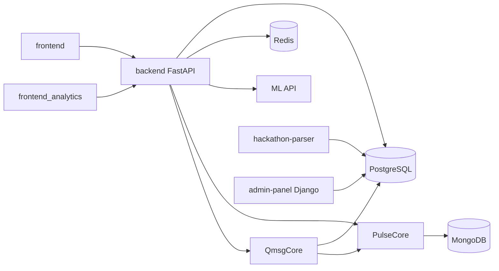

# ComIT-ViribusHack

Монорепозиторий платформы ComIT для командной работы, контента и AI-инструментов.

Проект объединяет:

- основной SPA (`frontend`) и отдельную аналитику (`frontend_analytics`),
- API-шлюз на FastAPI (`backend`) с PostgreSQL/Redis,
- AI-чат и воркфлоу (`PulseCore`) с MongoDB,
- групповые чаты (`QmsgCore`) на Go + WebSocket,
- парсер хакатонов и IT-новостей (`hackathon-parser`),
- ML-сервис рекомендаций (`ML`),
- Django admin-panel (`admin-panel`).

### Протестировать сайт
https://comit.robofirst.ru/

## Figma проекта
https://www.figma.com/design/4ferZ0muDwZe9Qh8iPRtiO/%D0%A5%D0%90%D0%9A%D0%90%D0%A2%D0%9E%D0%9D?node-id=0-1&p=f&t=xwQ1RNWlXpxzycK2-0

## Презентация проекта
https://docs.google.com/presentation/d/1NHAbkkhbvQBN345mIWRH_dMzHc0q7kk20pPSl6MKEZY/edit?slide=id.p#slide=id.p

## 1. Технологический стек

- Python 3.12 (FastAPI, Django, вспомогательные сервисы)
- Node.js 20+ (React + Vite)
- Go 1.24 (QmsgCore)
- PostgreSQL 16, Redis 7, MongoDB 7
- Docker + Docker Compose

## 2. Архитектура и связи сервисов



Ключевая идея: `backend` — центральный API для фронтов и точка интеграции с `ML`, `PulseCore` и `QmsgCore`.

## 3. Структура репозитория

- `backend/` — основной FastAPI backend (модули, миграции, seed, тесты)
- `frontend/` — основной React SPA
- `frontend_analytics/` — отдельный React SPA для аналитики университетов
- `admin-panel/` — Django admin для управления данными
- `hackathon-parser/` — парсер хакатонов + RSS-новостей, пишет в PostgreSQL
- `ML/` — сервис рекомендаций (`/recommend/news`, `/recommend/events`, `/feedback`)
- `PulseCore/` — AI-агенты и очереди задач
- `QmsgCore/` — групповые чаты (REST + WebSocket) на Go
- `openapi/openapi.yaml` — экспортируемая OpenAPI-спецификация backend
- `docs/database-schema.md` — обзор схемы БД
- `deploy/` — продовые инструкции и nginx-конфиг

## 4. Быстрый старт (Docker, рекомендованный путь)

### 4.1 Подготовка переменных окружения

Из корня репозитория:

PowerShell:

```powershell
Copy-Item .env.example .env
```

bash:

```bash
cp .env.example .env
```

### 4.2 Поднять весь стек

```bash
docker compose --profile core up -d --build
```

### 4.3 Проверка

- Backend health: `http://localhost:8000/health`
- Backend docs: `http://localhost:8000/docs`
- Frontend: `http://localhost:8080`
- Admin-panel: `http://localhost:8010/admin/`
- Analytics frontend: `http://localhost:8081`
- Hackathon parser health: `http://localhost:8012/api/health`
- PulseCore (root): `http://localhost:8091/`
- QmsgCore health: `http://localhost:8090/healthz`

### 4.4 Полезные команды Compose

```bash
# Логи конкретного сервиса
docker compose logs -f backend

# Перезапуск сервиса
docker compose restart frontend

# Остановить стек
docker compose down

# Остановить стек и удалить тома БД (осторожно: потеря данных)
docker compose down -v
```

## 5. Локальная разработка без Docker (по сервисам)

### 5.1 Backend (`backend/`)

```bash
cd backend
python -m venv .venv
# Windows
.venv\Scripts\activate
# Linux/macOS
source .venv/bin/activate

pip install -r requirements.txt -r requirements-dev.txt
alembic upgrade head
python -m scripts.seed_db
uvicorn app.main:app --reload --host 0.0.0.0 --port 8000
```

Замечания:

- `backend/app/lifespan.py` при старте экспортирует OpenAPI в `openapi/openapi.yaml`.
- Отключить экспорт можно через `SKIP_OPENAPI_EXPORT=1`.

### 5.2 Main frontend (`frontend/`)

```bash
cd frontend
npm ci
npm run dev
```

Дополнительно:

```bash
# Перегенерировать типы API из OpenAPI
npm run generate:api
```

По умолчанию Vite проксирует:

- `/api` -> `VITE_API_PROXY_TARGET` (обычно `http://127.0.0.1:8000`)
- `/qmsg` -> `VITE_QMSG_PROXY_TARGET` (обычно `http://127.0.0.1:8090`)

### 5.3 Analytics frontend (`frontend_analytics/`)

```bash
cd frontend_analytics
npm ci
npm run dev
```

Прокси Vite: `/api` -> `VITE_API_PROXY_TARGET`.

### 5.4 Admin panel (`admin-panel/`)

```bash
cd admin-panel
python -m venv .venv
.venv\Scripts\activate  # Windows
pip install -r requirements.txt
python manage.py migrate
python manage.py runserver 0.0.0.0:8001
```

Health endpoint: `GET /health/`.

### 5.5 Hackathon parser (`hackathon-parser/`)

```bash
cd hackathon-parser
python -m venv .venv
.venv\Scripts\activate  # Windows
pip install -r requirements.txt
uvicorn app.main:app --reload --host 0.0.0.0 --port 8012
```

Ручные триггеры:

- `POST /api/parse/trigger` — парсинг хакатонов
- `POST /api/parse/trigger-news` — сбор IT-новостей

### 5.6 ML service (`ML/`)

```bash
cd ML
python -m venv .venv
.venv\Scripts\activate  # Windows
pip install -e ./Projects
pip install requests fastapi uvicorn psycopg2-binary
uvicorn api_server:app --reload --host 0.0.0.0 --port 9000
```

Основные endpoint'ы:

- `GET /health`
- `GET /recommend/news`
- `GET /recommend/events`
- `POST /feedback`

### 5.7 PulseCore (`PulseCore/`)

```bash
cd PulseCore
python -m venv .venv
.venv\Scripts\activate  # Windows
pip install -r requirements.txt
uvicorn main:app --reload --host 0.0.0.0 --port 8091
```

### 5.8 QmsgCore (`QmsgCore/backend/`)

```bash
cd QmsgCore/backend
go mod download
go run ./cmd/server/main.go
```

Сервис поднимает миграции из `migrations/001_init.sql` при старте.

## 6. Переменные окружения (ключевые)

Файл: `.env` в корне (используется `docker-compose` и Python-сервисами).

### 6.1 Инфраструктура

- `POSTGRES_USER`, `POSTGRES_PASSWORD`, `POSTGRES_DB`, `POSTGRES_PORT`
- `REDIS_PORT`
- `MONGO_PORT`

### 6.2 Backend

- `DATABASE_URL` — DSN для FastAPI и admin-panel
- `REDIS_URL`
- `JWT_SECRET`, `JWT_LIFETIME_SECONDS`
- `QMSG_CORE_BASE_URL`
- `PULSE_CORE_BASE_URL`
- `ML_SERVICE_URL`
- `SKIP_SEED` — отключить автоматический seed в Docker backend

### 6.3 Frontend

- `VITE_API_PROXY_TARGET` — API для Vite dev proxy
- `VITE_QMSG_PROXY_TARGET` — QmsgCore для Vite dev proxy
- `VITE_API_BASE_URL` — base URL для production-сборки frontend
- `VITE_API_STATIC_FALLBACK` — включение/выключение fallback на demo-данные

### 6.4 Admin-panel

- `DJANGO_SECRET_KEY`
- `DJANGO_DEBUG`
- `DJANGO_ALLOWED_HOSTS`
- `DJANGO_SUPERUSER_EMAIL`, `DJANGO_SUPERUSER_PASSWORD`

### 6.5 Parser / ML

- `PARSE_INTERVAL_HOURS`
- `NEWS_PARSE_INTERVAL_HOURS`
- `GIGACHAT_AUTH_KEY` (для ML/эмбеддингов)

## 7. База данных, миграции и seed

- Alembic миграции backend: `backend/alembic/versions/`
- Полезная схема: `docs/database-schema.md`
- Применить миграции:

```bash
cd backend
alembic upgrade head
```

- Seed:

```bash
cd backend
python -m scripts.seed_db
```

Варианты seed:

- `python -m scripts.seed_db --wipe`
- `python -m scripts.seed_db --module news`
- `python -m scripts.seed_db --module projects --wipe`

## 8. API и документация

Backend:

- Swagger: `/docs`
- ReDoc: `/redoc`
- JSON OpenAPI: `/openapi.json`
- YAML OpenAPI: `openapi/openapi.yaml` (автоэкспорт при старте backend)

Важные префиксы backend API:

- `/api/auth/*`, `/api/users/*`
- `/api/dashboard/*`
- `/api/projects/*`
- `/api/news/*`
- `/api/hackathons/*`
- `/api/it-news/*`
- `/api/profile/*`
- `/api/library/*`
- `/api/notifications/*`
- `/api/recommendations/*`
- `/api/pulse/*`
- `/api/groupchat/*`
- `/api/analytics/*`

## 9. Тестирование и качество

### 9.1 Backend

```bash
cd backend
ruff check app tests --output-format=concise
python -m pytest tests -v --cov=app --cov-report=term-missing
```

### 9.2 Frontend

```bash
cd frontend
npm ci
npm run build
```

### 9.3 ML

```bash
python -m pytest ML/tests/test_api_smoke.py -v
```

## 10. CI/CD (Drone)

Файл пайплайна: `.drone.yml`.

Что происходит:

1. `backend-lint` — `ruff check backend/app backend/tests`
2. `backend-test` — `pytest` с coverage
3. `frontend-build` — `npm ci && npm run build`

На `main/master` дополнительно выполняются шаги:

- `docker-compose-build`
- `deploy` через `docker compose --profile core up -d --build`
- `cleanup` старых образов

## 11. Дополнительные документы

- Подробно по PulseCore: `PulseCore/README.md`
- Подробно по QmsgCore: `QmsgCore/README.md`
- Подробно по ML: `ML/README.md`
- Общая схема БД: `docs/database-schema.md`
- Прод-домены и HTTPS: `deploy/README-prod-domains.md`
- QmsgCore (подробно): `QmsgCore/docs/QMSGCORE_MESSAGING_SYSTEM.md`
- QmsgCore integration: `QmsgCore/docs/integration.md`
- PulseCore API-гайд: `PulseCore/docs.md`
- OpenAPI spec: `openapi/openapi.yaml`

## 12. Частые проблемы (исправлено)

### Backend не стартует с ошибкой БД

- Проверь `DATABASE_URL`.
- Убедись, что PostgreSQL доступен на указанном хосте/порту.
- Выполни `alembic upgrade head`.

### Frontend не видит API

- Для dev проверь `VITE_API_PROXY_TARGET`.
- Для production-сборки проверь `VITE_API_BASE_URL` (без trailing slash).

### 401/403 в интеграции с QmsgCore

- Убедись, что `JWT_SECRET` в backend и `GC_JWT_SECRET` в QmsgCore согласованы.

### Не работает AI-чат

- Проверь `PULSE_CORE_BASE_URL` в backend.
- Проверь доступность `PulseCore` и его MongoDB.
