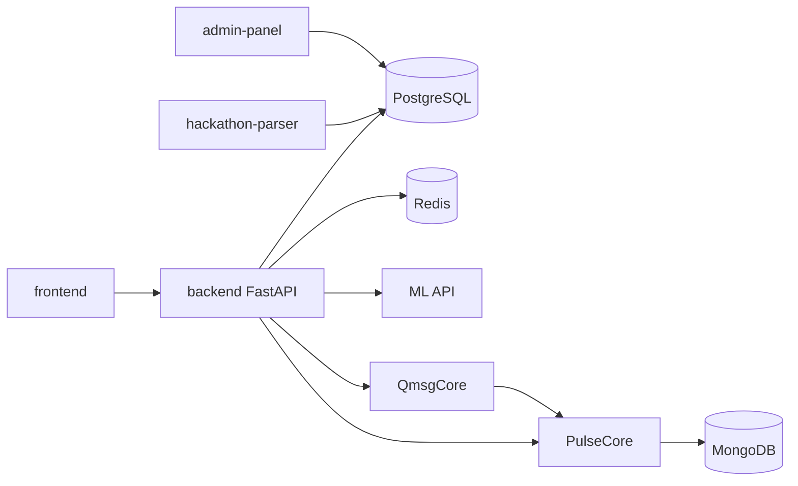

# ComIT

Платформа для студентов: командные проекты, хакатоны, новости, AI-ассистент и групповые чаты.

**[Открыть сайт](https://comit.robofirst.ru/)** · [Figma](https://www.figma.com/design/4ferZ0muDwZe9Qh8iPRtiO/%D0%A5%D0%90%D0%9A%D0%90%D0%A2%D0%9E%D0%9D?node-id=0-1&p=f&t=xwQ1RNWlXpxzycK2-0) · [Презентация](https://docs.google.com/presentation/d/1NHAbkkhbvQBN345mIWRH_dMzHc0q7kk20pPSl6MKEZY/edit?slide=id.p#slide=id.p)

## Стек

| Слой | Технологии |
|------|-----------|
| Frontend | React + Vite, Framer Motion |
| Backend | FastAPI (Python 3.12), PostgreSQL 16, Redis 7 |
| Чаты | Go 1.24 + WebSocket (QmsgCore) |
| AI | FastAPI + MongoDB (PulseCore) |
| ML | GigaChat embeddings, персонализированные рекомендации |
| Инфра | Docker Compose, Drone CI, nginx |

## Архитектура



## Быстрый старт

```bash
cp .env.example .env        # заполни секреты
docker compose --profile core up -d --build
```

| Сервис | URL |
|--------|-----|
| Frontend | http://localhost:8080 |
| Backend API | http://localhost:8000/docs |
| Admin | http://localhost:8010/admin/ |
| Analytics | http://localhost:8081 |

## Структура репозитория

```
backend/          FastAPI backend + миграции Alembic
frontend/         React SPA
frontend_analytics/ Аналитика университетов
admin-panel/      Django admin
hackathon-parser/ Парсер хакатонов и IT-новостей
ML/               Сервис рекомендаций
PulseCore/        AI-агент + очереди задач
QmsgCore/         Групповые чаты (Go)
openapi/          OpenAPI spec (авто-экспорт при старте backend)
deploy/           Nginx-конфиг и прод-инструкции
```

## Локальная разработка

**Backend:**
```bash
cd backend && pip install -r requirements.txt -r requirements-dev.txt
alembic upgrade head && python -m scripts.seed_db
uvicorn app.main:app --reload
```

**Frontend:**
```bash
cd frontend && npm ci && npm run dev
```

Остальные сервисы — см. README в их папках.

## Ключевые переменные окружения

- `DATABASE_URL`, `REDIS_URL`, `JWT_SECRET`
- `QMSG_CORE_BASE_URL`, `PULSE_CORE_BASE_URL`, `ML_SERVICE_URL`
- `VITE_API_BASE_URL` — задать до `docker compose build frontend`
- `GIGACHAT_AUTH_KEY` — для ML-эмбеддингов
